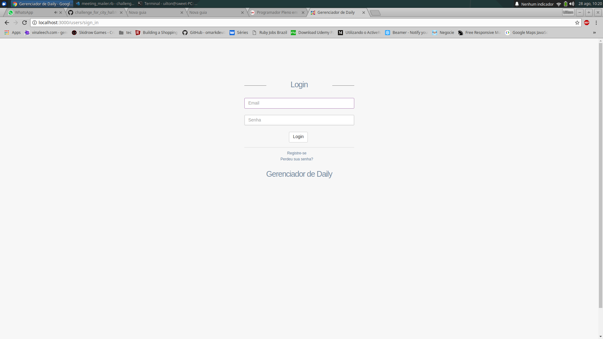
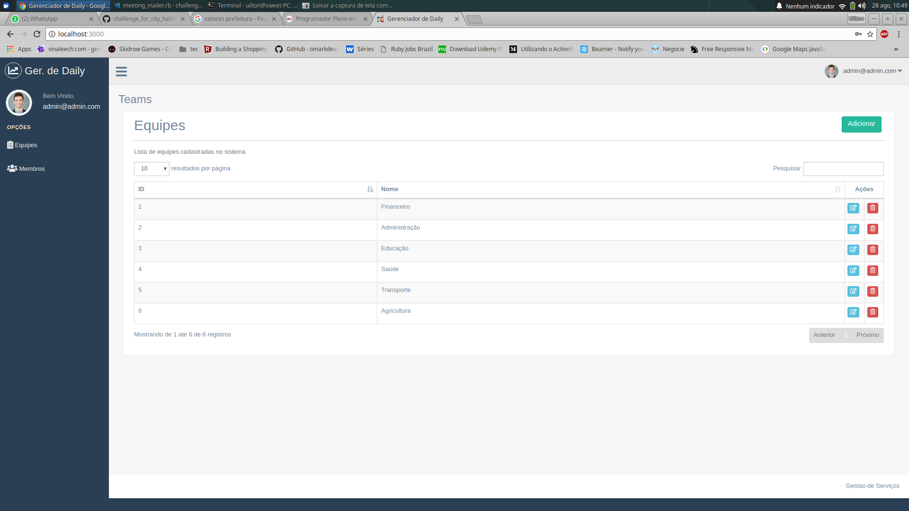
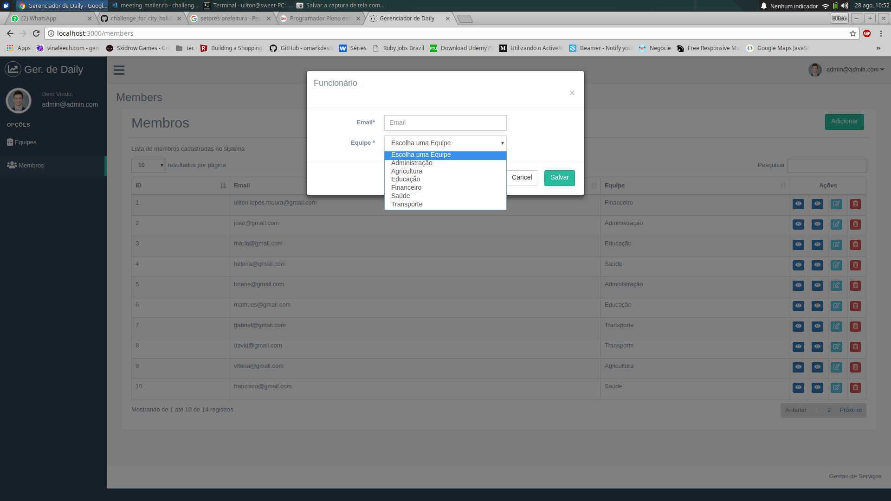
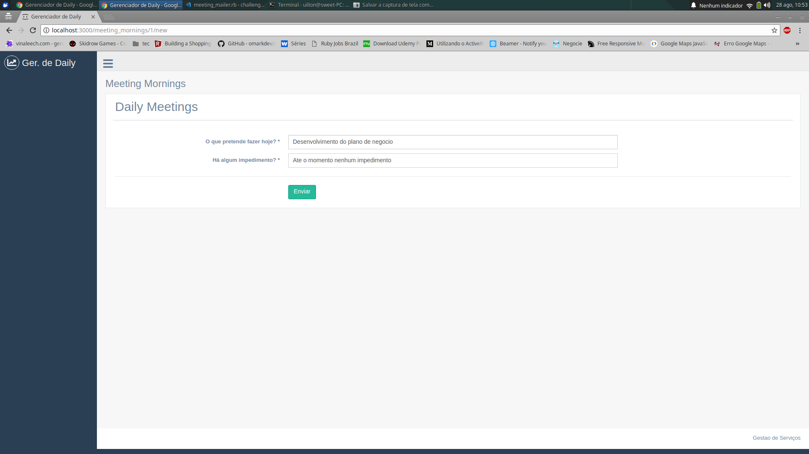
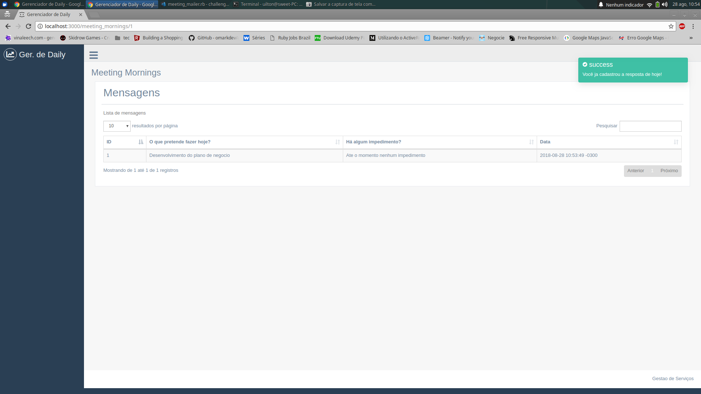

#=== Gerenciador de Daily ====

Esta aplicação tem como objetivo guardar os resultados das “daily meetings” de uma equipe específica. Para isso é necessário ter uma lista de usuários. Cada usuário deverá receber um email em horários pre-programados com um link para que ele responda a uma pergunta. Não existe necessidade de ser um mail resposta. Apenas o link para aplicação e nesse link teria o formulário de pergunta e resposta. Deve-se enviar o mail às 8:00 da manhã pedindo para responder "O que pretende fazer hoje? Há algum impedimento?", e novamente um email às 16:00 com a pergunta "O que você realizou hoje? Houve algum impedimento?". É necessário disponibilizar o projeto em repositório do Bitbucket e o link deve ser informado ao responsável pela entrevista.


- As equipes devem ser cadastradas

- Cada pessoa pertence a uma equipe.

- O usuário pode consultar as respostas anteriores dele.

# Resolução para o desafio proposto
## Tecnologias usadas:
* Ruby 2.5.1p57 (2018-03-29 revision 63029)
* Rails 5.2.1 
* PostgreSQL 10.5
* Template - [Gentelella](https://github.com/puikinsh/gentelella)
* Datatables ajax rails  - [Datatables](https://github.com/jbox-web/ajax-datatables-rails)

## Para rodar o projeto

**Siga os seguintes passos**

```
git clone https://github.com/uiltonlopes/challenge_for_city_hall.git
```
```
cd challenge_for_city_hall
```
```
bundle install
```
```
rails db:create db:migrate
```
```
rails s
```






